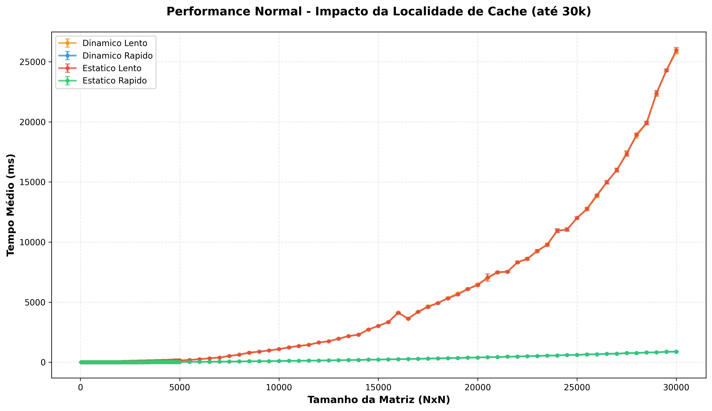

# Avaliação de Desempenho: Memória Cache e Localidade Espacial


Este repositório contém os códigos e scripts utilizados para o Trabalho Prático de **Organização de Computadores**. O objetivo é analisar empiricamente o impacto da hierarquia de memória (Cache L1/L2/L3 e RAM) no desempenho de algoritmos em C.

O projeto compara o acesso à memória **Row-Major** (amigável à cache) versus **Column-Major** (não amigável), além de analisar o comportamento do sistema quando ocorre **Swapping** (uso de disco).

[Veja o relátorio completo do projeto aqui](https://www.overleaf.com/read/ptrrpyfvhynd#30df3e)

---

## 📊 Visão Geral do Experimento

Foram implementados 4 cenários de teste para percorrer matrizes de inteiros/structs e realizar cálculos aritméticos simples:

1.  **Estático Rápido:** Alocação na Stack, acesso sequencial (`i` depois `j`).
2.  **Estático Lento:** Alocação na Stack, acesso com salto (`j` depois `i`).
3.  **Dinâmico Rápido:** Alocação na Heap (`malloc`), acesso sequencial.
4.  **Dinâmico Lento:** Alocação na Heap (`malloc`), acesso com salto.

### 🧪 Resultados Esperados
O acesso "Lento" provoca excessivos **Cache Misses**, pois a cada leitura, uma linha de cache é carregada mas apenas um valor é aproveitado antes do salto de memória.


*Figura 1: Comparação de tempo de execução (ms) por tamanho de matriz.*

---

## 📂 Estrutura do Projeto

| Arquivo | Descrição |
| :--- | :--- |
| `dinamico_rapido.c` | Código otimizado com alocação dinâmica. |
| `dinamico_lento.c` | Código não otimizado com alocação dinâmica. |
| `estatico_rapido.c` | Código otimizado com alocação estática. |
| `estatico_lento.c` | Código não otimizado com alocação estática. |
| `run_testes.sh` | **Script de Automação** (Compilação e Execução). |
| `setup.sh` | Configuração ambiente chamada pelo script de automação. |
| `gerar_graficos.py` | Script Python para análise de dados e plotagem. |
| `info_sistema.txt` | Logs automáticos do hardware utilizado no teste. |
| `resultados_completos.csv` | CSV gerado durante a avaliação de desempenho |
| `estatisticas.csv` | CSV gerado ao final da avaliação de desempenho|

---

## ⚙️ Automatização

Este projeto conta com um fluxo de trabalho 100% automatizado via Shell Script e Python. O script `run_testes.sh` é responsável por:

1.  Detectar automaticamente as especificações da CPU e Cache.
2.  Compilar os códigos C variando a flag `TAM` (Tamanho da Matriz) via diretiva de pré-processador.
3.  Executar testes incrementais (de N=50 a N=30.000+).
4.  Coletar os tempos e salvar em CSV.
5.  Acionar o script Python para gerar os gráficos.

### Pré-requisitos
* **GCC** (Compiler Collection)
* **Python 3**
* Bibliotecas Python: `pandas`, `matplotlib`, `numpy`

### Como Rodar

1.  **Clone o repositório:**
    ```bash
    git clone [https://github.com/rochatobias/CacheMemory-automation.git]
    cd [CacheMemory-automation]
    ```

2.  **Dê permissão de execução ao script:**
    ```bash
    chmod +x run_testes.sh
    ```

3.  **Execute a automação:**
    ```bash
    ./run_testes.sh
    ```
    *O script irá compilar os binários, rodar os testes (isso pode levar alguns minutos) e gerar o arquivo `resultados_completos.csv`.*

4.  **Gere os Gráficos (caso não rode automático):**
    ```bash
    python3 gerar_graficos.py
    ```

---

## 📈 Análise de Swapping

Para tamanhos de matriz que excedem a memória RAM física disponível (testes acima de 15GB de RAM no meu ambiente de teste), o sistema entra em **Thrashing**, utilizando o disco (Swap) como extensão da memória.


---
